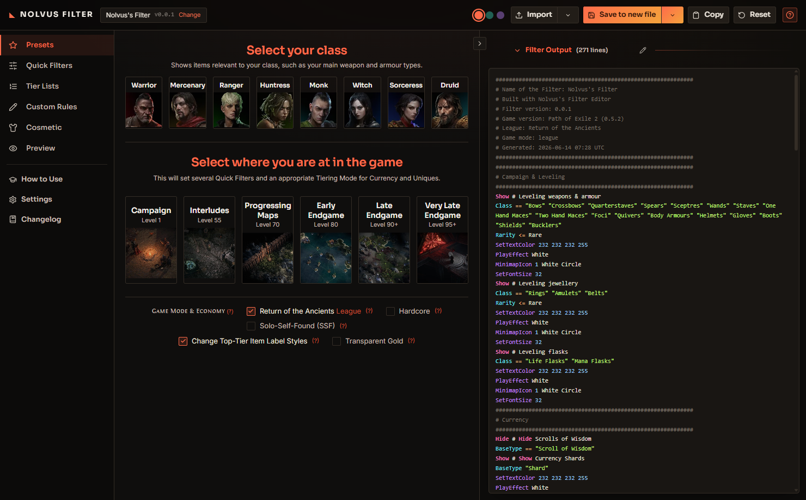
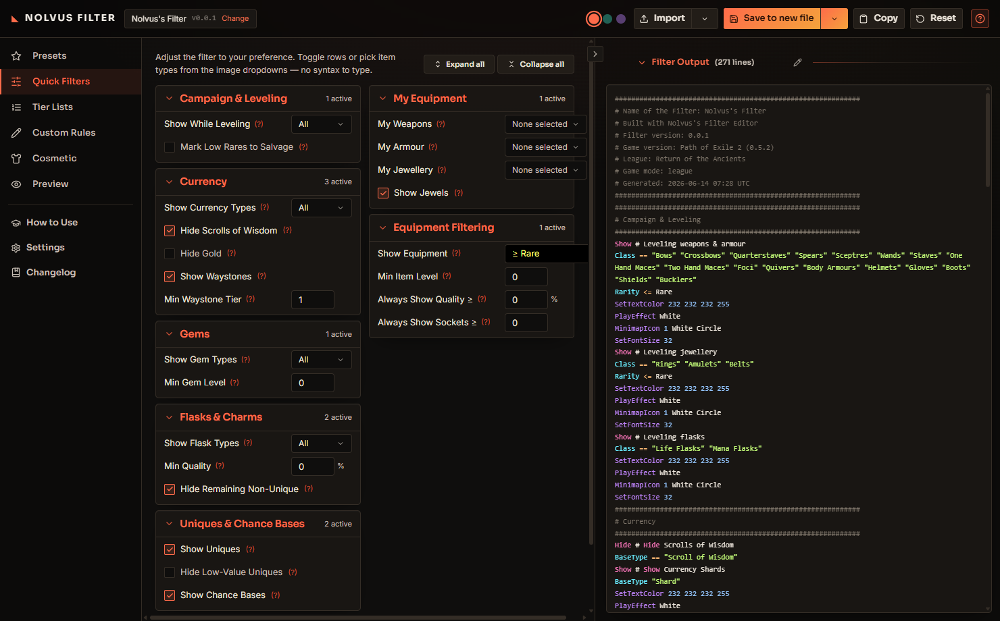
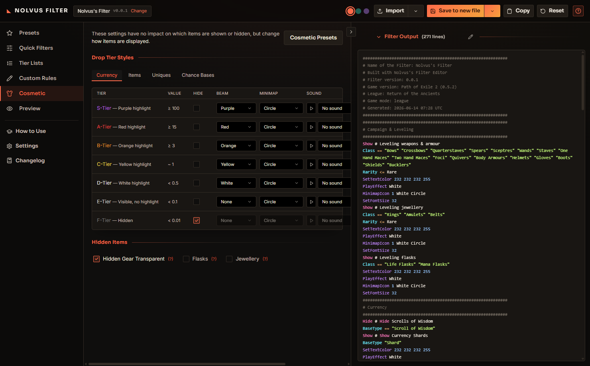

# Nolvus Filter

**A visual loot-filter studio for Path of Exile 2 — build a filter you can *see*, not a file you have to type.**

Nolvus Filter turns loot-filter creation into a workstation experience: pick a starting point, tune what drops and how it looks through image dropdowns and sliders, watch the real `.filter` build itself live, then export and play. No syntax to memorise, no wall of raw text — every control is wired to a clean, in-game-valid filter.



## Why Nolvus Filter

- **Visual first.** Choose item types from dropdowns with real PoE2 art. You never write a `Class ==` line by hand unless you want to.
- **A real workstation.** A left nav rail, a top action bar, and a docked live-output panel — your filter is always in view while you edit.
- **Instant, honest output.** The right-hand panel regenerates valid PoE2 filter syntax on every change. What you see is exactly what loads in-game.
- **Yours to theme.** Three hand-tuned dark themes (Ember, Abyss, Arcane) with a sharp, angular, game-native look.
- **Two ways to run it.** Use it on the web, or install the standalone **Windows desktop app** — same studio, offline-capable.
- **Plays well with others.** Import any standard `.filter` (NeverSink / Filterblade exports included) and keep editing; unknown directives are preserved on round-trip.

## The studio

| Section | What it does |
|---|---|
| **Presets** | Pick your class and where you are in the game; sensible defaults are applied everywhere. |
| **Quick Filters** | Toggle and tune what shows or hides through grouped image dropdowns. |
| **Tier Lists** | Rank currency and uniques by value — higher tiers get stronger highlights. |
| **Custom Rules** | Your own Show/Hide rules at the highest priority, still dropdown-driven. |
| **Cosmetic** | Text colour, beams, minimap icons, and drop sounds per value tier — audition each sound. |
| **Preview** | See your filter rendered as real in-game item labels over a scene, then export. |

Plus a **How to Use** walkthrough, **Settings** (themes, league/version, custom comments), a **Changelog**, and an in-app legend that explains every symbol.




## Develop

```bash
npm install
npm run dev        # http://localhost:5173
npm run build      # → dist/
npm test           # vitest
```

Built with Vite + React 18, Tailwind CSS, and MUI (themed, not stock). Hash router so filter state survives tab switches. Real PoE2 item art, fonts, and alert sounds.

## Windows desktop app

The desktop build wraps the same web app in a native Electron shell that serves the bundled build locally (works offline). See [`electron/README.md`](electron/README.md).

```bash
npm run build          # build the web app first
npm run electron       # run the desktop shell against the build
npm run dist:win       # package a Windows installer → release/
```

## Export & use in-game

Export a `.filter` from the top bar, drop it in
`Documents\My Games\Path of Exile 2\`, then select it in-game under
**Options → Game → Loot Filter**. Output is standard PoE2 filter syntax.
