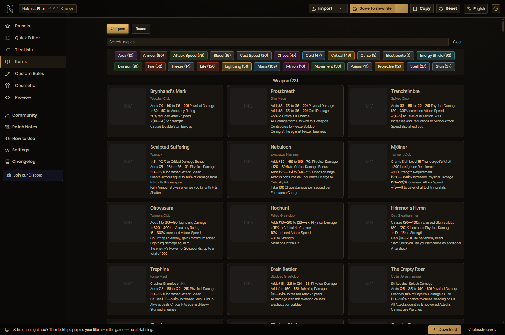
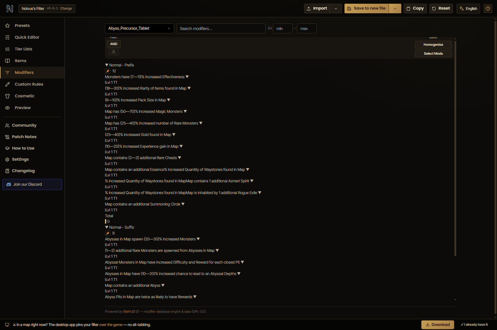

# PoE2 Champions

**A Path of Exile 2 companion: a visual loot-filter studio you can *see*, plus a plugin platform for the rest of your grind.**

**▶ Live:** [poe2champions.xyz](https://poe2champions.xyz) · **⬇ Windows app:** [latest release](https://github.com/NolvusMadeIt/nolvusfilter-releases/releases/latest) · **💬 [Discord](https://discord.gg/4gueh3Kb3A)**

Pick a starting point, tune what drops and how it looks through image dropdowns and sliders, and watch the real `.filter` build itself live — no syntax to memorise, every control wired to clean, in-game-valid PoE2 filter output. Then take it further: the Windows app pins the studio over the game and runs live plugins for price checking, the currency market and campaign speedruns.


## The studio

| Section | What it does |
|---|---|
| **Presets** | Pick your class and where you are in the game; sensible defaults are applied everywhere. |
| **Quick Editor** | Grouped show/hide controls for campaign, flasks & charms, currency, uniques, your equipment and more — each wired to a real Show/Hide rule that layers on top of the preset. |
| **Tier Lists** | Rank currency and uniques by value — higher tiers get stronger highlights. |
| **Custom Rules** | Your own Show/Hide rules at the highest priority; paste a copied item to build one. |
| **Cosmetic** | Text colour, beams, minimap icons and drop sounds per value tier — audition each sound. |
| **Preview** | Your filter rendered as real in-game item labels, plus a "will this drop show?" tester. |
| **Community** | Share the filter you built, or browse and one-click-load filters from other exiles. |

Plus filter/build **import** (a standard `.filter` or a `.build` export bakes into editable settings), a **How to Use** walkthrough, three dark themes, and in-app changelog & PoE2 patch notes.

## Plugins

The app is a plugin platform with a WordPress-style manager (Settings ▸ Plugins): install, activate, deactivate, update or delete add-ons — each brings its own page, nav entry and settings, and the app works fully with everything off.

| Plugin | What it does |
|---|---|
| **Filter & Build Editor** | Monaco-based PoE2 filter IDE — syntax highlighting + autocomplete with real base-type names. On by default; even this is removable. |
| **Item Database** | Every PoE2 unique and base type, searchable and chip-filterable — see below. |
| **Modifiers** | Every affix by item category — tiers, weights, ilvl gates — searchable and filterable. |
| **Price Check** *(desktop)* | Paste an item, pick the stats that matter, get real listings from the official trade through your own session — sell verdict, in-demand stats, reliability. Web falls back to poe2scout spot prices. |
| **Market Companion** *(desktop)* | Live currency market — prices in Exalted/Divine, 24h change, volume, charts and buy/sell signals via poe2scout. |
| **Campaign Mode** *(desktop for live tracking)* | Zone-by-zone leveling guide with layout maps, plus a Speedrun mode: critical-path route, prep checklist and a game-log run timer that pauses in town/hideout/idle, with saved runs and splits. |

### Item Database

Browse every unique (grouped Weapon / Armour / Other) and every base type in the game, with
mod-category filter chips and instant search — on the web or in the overlay, no game running
required. The browsing engine and curated datasets are **powered by
[XileHUD](https://github.com/XileHUD/poe_overlay)** (GPL-3.0), wearing this app's Exile theme.



### Modifiers

Pick any item category and see every prefix and suffix that can roll on it — full tier
ladders with spawn weights and item-level gates, instant search (`-token` for strict
matches), ilvl range filters and mod-tag chips. The virtualized list keeps even the
heaviest aggregate categories smooth. Engine and data **powered by
[XileHUD](https://github.com/XileHUD/poe_overlay)** (GPL-3.0), in this app's Exile theme.



## Web vs desktop

The browser version builds, imports and exports filters — free, no account. The **Windows desktop app** (Electron, serves the bundled build locally, works offline) adds what a browser can't:

- **In-game overlay** — pins the studio over PoE2 in Borderless mode, docked left/right, toggled with a hotkey (default **Shift+Alt+F**), multi-monitor aware. See [`electron/README.md`](electron/README.md).
- Live plugin features: Price Check against the official trade, the live Market, and game-log tracking for Campaign/Speedrun.
- System-tray icon, frameless window, auto-updates from GitHub releases.

Releases are published to [NolvusMadeIt/nolvusfilter-releases](https://github.com/NolvusMadeIt/nolvusfilter-releases) as `NolvusFilter-Setup-<version>.exe` (installer) and `NolvusFilter-Portable-<version>.exe`.

## Develop

```bash
npm install
npm run dev        # web app → http://localhost:5173
npm test           # vitest
npm run build      # web build → dist/
npm run electron   # desktop shell against the build
npm run dist:win   # package Windows installer + portable → release/
npm run landing    # marketing landing dev server → http://localhost:4321
```

Vite + React 18, Tailwind, MUI (themed), Zustand, hash router; Supabase for community filters; real PoE2 item art, fonts and alert sounds.

## Repo layout

```
src/                the app — pages, stores, filter generator/parser
src/plugins/        built-in plugins (filter-editor, xile-items, price-check, market-companion, campaign-guide)
src/xilehud/        vendored XileHUD modules (GPL-3.0, origin banners) + our adapter/theme bridge
public/xilehud/     static dataset snapshots the database plugins fetch on demand
electron/           desktop shell: frameless window, tray, game overlay, updater
landing/            marketing page (source of truth; {{APP_VERSION}} placeholders)
public/home/        generated copy of the landing the app iframes on #/home
scripts/sync-landing.mjs   regenerates public/home from landing/ + package.json version
docs/               screenshots & design notes
```

After editing `landing/index.html`, run `node scripts/sync-landing.mjs` — it injects the real version and rewrites link targets for the iframe. Never edit `public/home/index.html` directly.

## Export & use in-game

Export a `.filter` from the top bar, drop it in `Documents\My Games\Path of Exile 2\`, then select it in-game under **Options → Game → Loot Filter**. Output is standard PoE2 filter syntax.

## License & credits

PoE2 Champions is open source under the **[GPL-3.0](LICENSE)** license.

The Item Database and related overlay modules are **powered by [XileHUD](https://github.com/XileHUD/poe_overlay)**
(GPL-3.0) — see [ATTRIBUTION.md](ATTRIBUTION.md) for the full credits, including the projects that
inspired this app's look and the data sources it relies on.

---

*Not affiliated with or endorsed by Grinding Gear Games. Path of Exile 2 is a trademark of Grinding Gear Games.*
